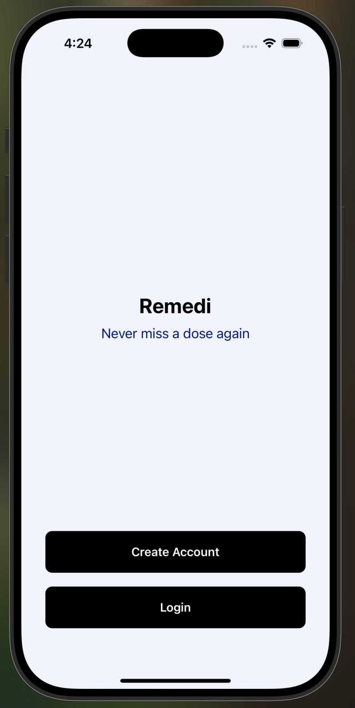
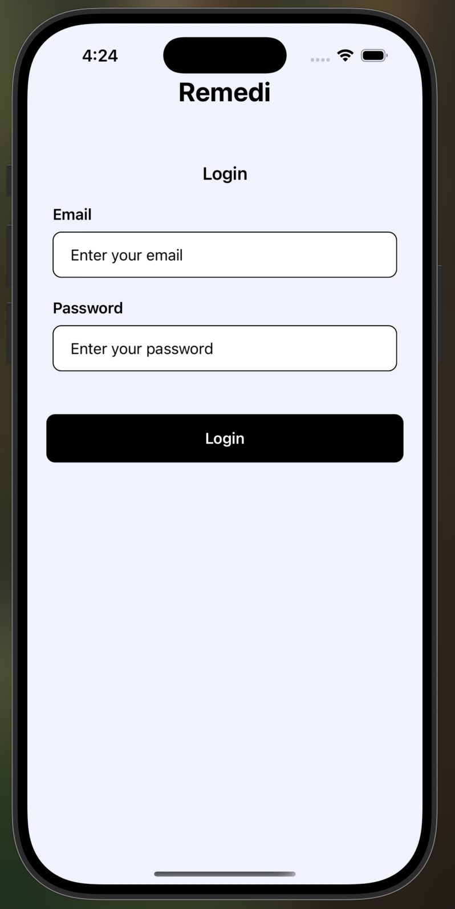
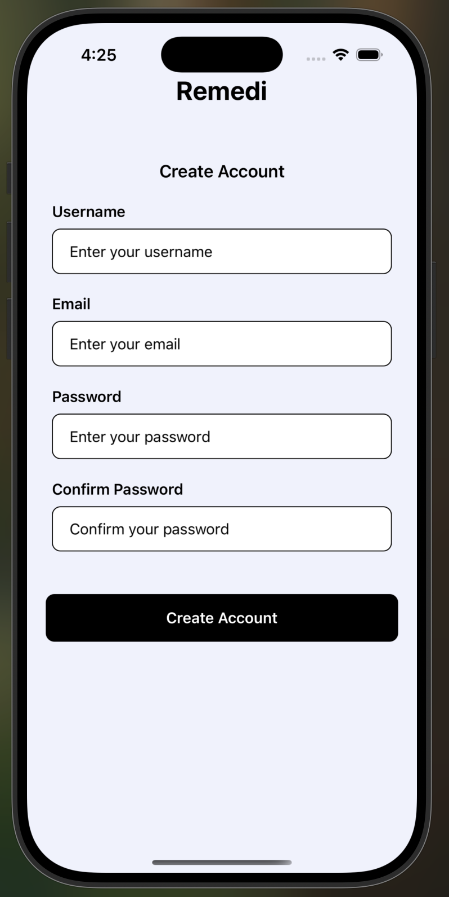
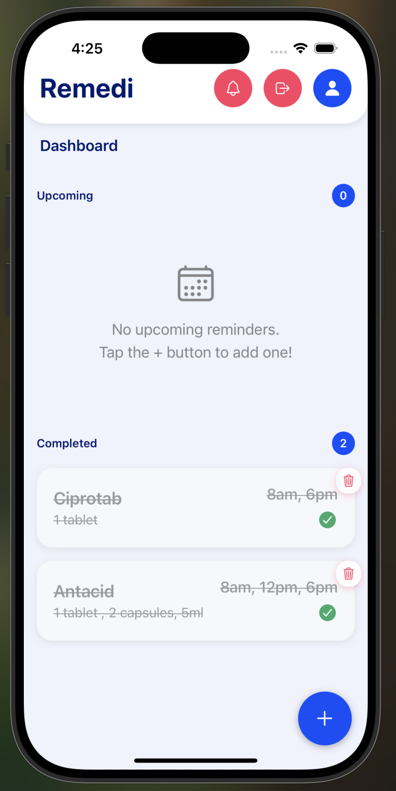
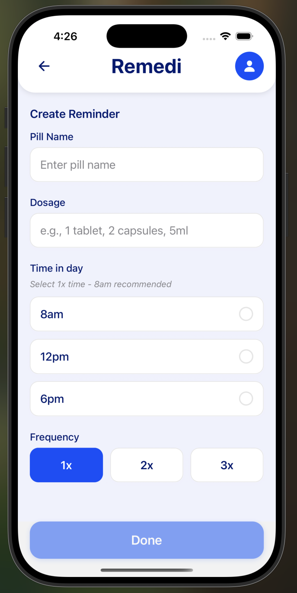
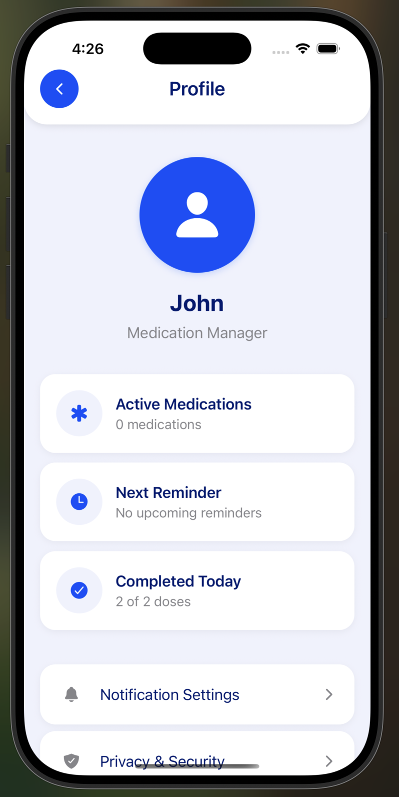

# Remedi 💊
**Never miss a dose again**

Remedi is a React Native medication reminder app that helps you stay on track with your medication schedule through smart notifications and an intuitive interface.

## Features

- 🔐 **Secure Authentication** - Create account and login with persistent storage
- 💊 **Medication Management** - Add, edit, and track your medications
- ⏰ **Smart Reminders** - Set custom notification times for each medication
- 📊 **Progress Tracking** - View completed and upcoming medication schedules
- 🎨 **Beautiful UI** - Clean, modern interface designed for ease of use
- 📱 **Cross Platform** - Works on both iOS and Android

## Screenshots

### Onboarding & Authentication
| Onboarding | Login | Register |
|------------|-------|----------|
|  |  |  |

### Main App Features
| Home Screen | Add Reminder | Profile |
|-------------|--------------|---------|
|  |  |  |

## Tech Stack

- **Framework**: React Native
- **Language**: TypeScript
- **Navigation**: React Navigation
- **Storage**: AsyncStorage
- **Notifications**: react-native-push-notification
- **Icons**: react-native-vector-icons
- **State Management**: React Context API
- **Authentication**: Custom auth service with AsyncStorage
- **UI Components**: Custom component library

## Architecture

- **Clean Architecture**: Separation of concerns with services, contexts, and components
- **Service Layer**: Dedicated services for authentication, notifications, and reminders
- **Context Providers**: Global state management for auth and notifications
- **Custom Hooks**: Reusable logic for screens and components
- **TypeScript**: Full type safety throughout the application

## Installation

### Prerequisites

- Node.js (v16 or higher)
- npm or yarn
- React Native development environment
- Xcode (for iOS development)
- Android Studio (for Android development)

### Clone and Install

```bash
# Clone the repository
git clone https://github.com/HenryTruth/Remedi.git
cd Remedi

# Install dependencies
npm install

# iOS specific setup
cd ios && bundle install && bundle exec pod install && cd ..
```

## Getting Started

> **Note**: Make sure you have completed the [Set Up Your Environment](https://reactnative.dev/docs/set-up-your-environment) guide before proceeding.

## Step 1: Start Metro

First, you will need to run **Metro**, the JavaScript build tool for React Native.

To start the Metro dev server, run the following command from the root of your React Native project:

```sh
# Using npm
npm start

# OR using Yarn
yarn start
```

## Step 2: Build and run your app

With Metro running, open a new terminal window/pane from the root of your React Native project, and use one of the following commands to build and run your Android or iOS app:

### Android

```sh
# Using npm
npm run android

# OR using Yarn
yarn android
```

### iOS

For iOS, remember to install CocoaPods dependencies (this only needs to be run on first clone or after updating native deps).

The first time you create a new project, run the Ruby bundler to install CocoaPods itself:

```sh
bundle install
```

Then, and every time you update your native dependencies, run:

```sh
bundle exec pod install
```

For more information, please visit [CocoaPods Getting Started guide](https://guides.cocoapods.org/using/getting-started.html).

```sh
# Using npm
npm run ios

# OR using Yarn
yarn ios
```

If everything is set up correctly, you should see your new app running in the Android Emulator, iOS Simulator, or your connected device.

This is one way to run your app — you can also build it directly from Android Studio or Xcode.

## Step 3: Modify your app

Now that you have successfully run the app, let's make changes!

Open `App.tsx` in your text editor of choice and make some changes. When you save, your app will automatically update and reflect these changes — this is powered by [Fast Refresh](https://reactnative.dev/docs/fast-refresh).

When you want to forcefully reload, for example to reset the state of your app, you can perform a full reload:

- **Android**: Press the <kbd>R</kbd> key twice or select **"Reload"** from the **Dev Menu**, accessed via <kbd>Ctrl</kbd> + <kbd>M</kbd> (Windows/Linux) or <kbd>Cmd ⌘</kbd> + <kbd>M</kbd> (macOS).
- **iOS**: Press <kbd>R</kbd> in iOS Simulator.

## Project Structure

```
src/
├── components/          # Reusable UI components
│   ├── common/         # Common components (buttons, inputs, text)
│   ├── containers/     # Layout containers
│   └── headers/        # Header components
├── contexts/           # React Context providers
│   ├── AuthContext/    # Authentication state management
│   └── NotificationContext/ # Notification state management
├── screens/            # App screens
│   ├── home-screen/    # Main dashboard
│   ├── login-screen/   # User authentication
│   ├── profile-screen/ # User profile
│   └── reminder-form-screen/ # Add/edit reminders
├── services/           # Business logic services
│   ├── authService/    # Authentication operations
│   ├── notificationService/ # Push notifications
│   └── reminderService/ # Reminder CRUD operations
├── routers/            # Navigation configuration
└── configs/            # App configuration and constants
```

## Contributing

1. Fork the repository
2. Create your feature branch (`git checkout -b feature/amazing-feature`)
3. Commit your changes (`git commit -m 'Add some amazing feature'`)
4. Push to the branch (`git push origin feature/amazing-feature`)
5. Open a Pull Request

## License

This project is licensed under the MIT License - see the [LICENSE](LICENSE) file for details.

## Support

If you have any questions or need help with setup, please open an issue on GitHub.
